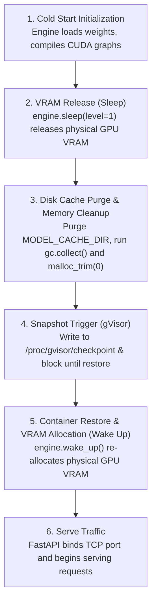

# GKE Fast Pod Snapshot Utility for vLLM

A modular container snapshot provider and vLLM lifespan wrapper that enables fast pod checkpointing and restoration on Google Kubernetes Engine (GKE) with GKE Sandbox (gVisor) and NVIDIA GPUs.

---

## Overview

Deploying large language models (LLMs) on Kubernetes often incurs multi-minute cold starts due to downloading model weights, loading them into memory, allocating GPU VRAM, and compiling CUDA graphs.

This package provides a drop-in launcher and snapshot provider that integrates with vLLM's FastAPI application lifespan to:
1. Initialize the vLLM engine and compile CUDA graphs during container cold start.
2. Put the vLLM engine to sleep (`engine.sleep(level=1)`) to release physical GPU VRAM while preserving virtual memory allocations.
3. Purge cached model weight files from disk to minimize the checkpoint footprint.
4. Trigger a gVisor userspace checkpoint via `/proc/gvisor/checkpoint`.
5. Restore the container and wake up the engine (`engine.wake_up()`) to re-allocate physical GPU VRAM upon restoration before binding HTTP ports and serving traffic.

---

## Architecture & Lifecycle

The snapshot lifecycle is orchestrated inside the FastAPI application lifespan context manager ([`vllm/wrapper.py`](file:///usr/local/google/home/ryanrosario/Code/llm-d/docker/scripts/snapshot/vllm/wrapper.py)):



---

## Prerequisites & Infrastructure Setup

### 1. GKE Cluster & GPU Node Pool

The cluster must have **Workload Identity** and **Pod Snapshots** enabled, and the GPU node pool must run with GKE Sandbox (gVisor):

```bash
# Create cluster with Pod Snapshots enabled
gcloud container clusters create "my-snapshot-cluster" \
  --region="us-east4" \
  --release-channel=rapid \
  --machine-type="e2-standard-4" \
  --num-nodes=1 \
  --workload-pool="<PROJECT_ID>.svc.id.goog" \
  --enable-pod-snapshots

# Create GPU node pool with gVisor sandbox enabled
gcloud container node-pools create gpu-snapshot-pool \
  --cluster=my-snapshot-cluster \
  --region=us-east4 \
  --machine-type=g2-standard-8 \
  --disk-size=200GB \
  --image-type=cos_containerd \
  --workload-metadata=GKE_METADATA \
  --sandbox type=gvisor \
  --accelerator=type=nvidia-l4,count=1,gpu-driver-version=latest \
  --num-nodes=1
```

Verify that the `gvisor` runtime class is available:

```bash
kubectl get runtimeclass gvisor
```

### 2. GCS Bucket & Workload Identity

Create a Google Cloud Storage bucket with **hierarchical namespace enabled** and bind Workload Identity permissions:

```bash
# 1. Create hierarchical namespace bucket
gcloud storage buckets create gs://my-snapshot-bucket \
  --location=us-east4 \
  --enable-hierarchical-namespace \
  --soft-delete-duration=0 \
  --uniform-bucket-level-access

# 2. Create GCP Service Account
gcloud iam service-accounts create snapshot-manager \
  --description="Service account for Pod snapshots" \
  --display-name="Snapshot Manager"

# 3. Grant bucket storage admin to the GCP SA
gcloud storage buckets add-iam-policy-binding gs://my-snapshot-bucket \
  --member="serviceAccount:snapshot-manager@<PROJECT_ID>.iam.gserviceaccount.com" \
  --role="roles/storage.admin"

# 4. Allow Kubernetes Service Account (KSA) to impersonate GCP SA
gcloud iam service-accounts add-iam-policy-binding snapshot-manager@<PROJECT_ID>.iam.gserviceaccount.com \
  --role="roles/iam.workloadIdentityUser" \
  --member="serviceAccount:<PROJECT_ID>.svc.id.goog[default/default]"

# 5. Annotate the KSA
kubectl annotate serviceaccount default \
  iam.gke.io/gcp-service-account=snapshot-manager@<PROJECT_ID>.iam.gserviceaccount.com \
  --overwrite
```

---

## GKE & Kubernetes Manifests

### 1. Storage Configuration (`PodSnapshotStorageConfig`)

Define the snapshot storage backend:

```yaml
apiVersion: podsnapshot.gke.io/v1
kind: PodSnapshotStorageConfig
metadata:
  name: pod-snapshot-storage-config
spec:
  snapshotStorageConfig:
    gcs:
      bucket: "my-snapshot-bucket"
      path: "/"
      tokenSource: "podKSA"
```

### 2. Snapshot Policy (`PodSnapshotPolicy`)

Configure automated, workload-triggered snapshots:

```yaml
apiVersion: podsnapshot.gke.io/v1
kind: PodSnapshotPolicy
metadata:
  name: pod-snapshot-policy
  namespace: default
spec:
  storageConfigName: pod-snapshot-storage-config
  selector:
    matchLabels:
      app: vllm-server
  triggerConfig:
    type: workload       # Allows the Python container to trigger the snapshot
    postCheckpoint: resume
```

### 3. Model Server Deployment

```yaml
apiVersion: apps/v1
kind: Deployment
metadata:
  name: vllm-server
  namespace: default
spec:
  replicas: 2
  selector:
    matchLabels:
      app: vllm-server
  template:
    metadata:
      labels:
        app: vllm-server
    spec:
      runtimeClassName: gvisor
      nodeSelector:
        sandbox.gke.io/runtime: gvisor
        cloud.google.com/gke-accelerator: nvidia-l4
      containers:
      - name: vllm
        image: vllm/vllm-openai:latest
        command:
        - python3
        - -m
        - docker.scripts.snapshot.launcher
        args:
        - --model
        - meta-llama/Llama-3.1-8B-Instruct
        - --safetensors-load-strategy
        - eager
        - --gpu-memory-utilization
        - "0.90"
        - --port
        - "8000"
        env:
        # Snapshot configuration
        - name: SNAPSHOT_PROVIDER
          value: "gke_gvisor"
        - name: MODEL_CACHE_DIR
          value: "/root/.cache/huggingface/hub"
        - name: HUGGING_FACE_HUB_TOKEN
          valueFrom:
            secretKeyRef:
              name: hf-token
              key: token
        # gVisor and NCCL compatibility settings
        - name: VLLM_HOST_IP
          value: "127.0.0.1"
        - name: MASTER_ADDR
          value: "127.0.0.1"
        - name: MASTER_PORT
          value: "29500"
        - name: NCCL_SOCKET_IFNAME
          value: "lo"
        - name: GLOO_SOCKET_IFNAME
          value: "lo"
        - name: NCCL_P2P_DISABLE
          value: "1"
        - name: NCCL_SHM_DISABLE
          value: "1"
        - name: TORCH_NCCL_ENABLE_MONITORING
          value: "0"
        - name: TORCH_NCCL_ASYNC_ERROR_HANDLING
          value: "0"
        resources:
          limits:
            nvidia.com/gpu: 1
        volumeMounts:
        - name: shm
          mountPath: /dev/shm
      volumes:
      - name: shm
        emptyDir:
          medium: Memory
          sizeLimit: 4Gi
```

---

## Configuration & Environment Variables

### Snapshot Variables

| Variable | Description | Default |
| :--- | :--- | :--- |
| `SNAPSHOT_PROVIDER` | Snapshot provider backend. Set to `gke_gvisor` to enable GKE gVisor snapshotting. If unset or any other value, snapshotting is disabled. | `""` (disabled) |
| `MODEL_CACHE_DIR` | Path to the local model weight cache directory to purge before triggering the checkpoint (e.g. `/root/.cache/huggingface/hub`). | `None` |

### gVisor & NCCL Compatibility Settings

Inside gVisor sandboxes, certain hardware and kernel primitives (P2P GPU memory access, host-level POSIX shared memory, external network probing) are restricted. The following variables ensure stable execution:

| Variable | Value | Purpose |
| :--- | :---: | :--- |
| `NCCL_P2P_DISABLE` | `1` | Disables GPU peer-to-peer communication, which is unsupported in gVisor. |
| `NCCL_SHM_DISABLE` | `1` | Disables host POSIX shared memory transport for NCCL to avoid sandbox permission errors. |
| `NCCL_SOCKET_IFNAME` | `lo` | Binds NCCL communication to the local loopback interface. |
| `GLOO_SOCKET_IFNAME` | `lo` | Binds Gloo communication to the local loopback interface. |
| `TORCH_NCCL_ENABLE_MONITORING` | `0` | Disables PyTorch NCCL watchdog threads that can interfere with gVisor freezing. |
| `TORCH_NCCL_ASYNC_ERROR_HANDLING` | `0` | Disables asynchronous error handling threads during checkpointing. |

### CLI Flags & Rationale

> [!IMPORTANT]
> When serving models with `safetensors`, pass `--safetensors-load-strategy eager` to vLLM.

- **Why:** By default, safetensors uses `mmap` (memory-mapping files directly from disk). If cached weight files are deleted before the snapshot to reduce storage size, memory-mapped file descriptors become invalid.
- Setting `--safetensors-load-strategy eager` forces vLLM to copy weights directly into RAM so disk caches can be safely purged.

---

## How GKE Matches Pods to Snapshots

With policy-based snapshotting (`PodSnapshotPolicy`), GKE transparently matches restored pods to the correct snapshot without needing hardcoded snapshot IDs:

1. **Distilled Pod Spec Hash:** GKE computes a hash over runtime-critical pod fields (container image, commands, environment variables, and sandbox settings).
2. **Node Compatibility Metadata:** GKE captures essential node metadata (node machine type, GPU accelerator type, and driver version).
3. **Lookup & Restoration:** When a new replica is scheduled, GKE matches the pod's distilled hash and node metadata to the most recent matching `PodSnapshot` in the cluster and restores directly from GCS.

---

## Monitoring & Verifying Snapshots

### 1. Monitor Snapshot Creation

Watch the PodSnapshot status during the initial cold start:

```bash
kubectl get podsnapshots -w
```

Status progression:
1. `AwaitingCheckpoint`: GKE signaled gVisor to freeze the container runtime.
2. `AllSnapshotsAvailable`: Snapshot files have been uploaded to GCS and are ready for restoration.

### 2. Verify Restore Logs

When a new pod restores from the snapshot, the vLLM logs show an instant wake-up:

```logs
(APIServer pid=1) [llm-d.snapshot.wrapper] INFO: Process restored from snapshot checkpoint. Resuming engine...
(APIServer pid=1) [llm-d.snapshot.wrapper] INFO: Executing engine.wake_up() to restore VRAM...
(EngineCore pid=55) INFO: It took 0.002859 seconds to wake up tags {'kv_cache', 'weights'}.
(APIServer pid=1) INFO: Application startup complete.
```

### 3. Networking & Testing in gVisor

> [!NOTE]
> In GKE Sandboxes (gVisor), direct `kubectl port-forward pod/<pod-name> 8000:8000` does not work because gVisor's internal network stack isolates `localhost` from the host runtime namespace.

**Test via In-Cluster Test Pod:**
```bash
kubectl run curl-test --rm -i --restart=Never \
  --image=cfmanteiga/alpine-bash-curl-jq:latest \
  -- /bin/sh -c 'curl -sS -X POST "http://<SERVICE_IP>:8000/v1/completions" -H "Content-Type: application/json" -d "{\"model\": \"meta-llama/Llama-3.1-8B-Instruct\", \"prompt\": \"Hello!\"}" | jq'
```

**Or Expose via Kubernetes Service:**
```bash
kubectl expose deployment vllm-server --port=8000 --target-port=8000 --name=vllm-service
kubectl port-forward service/vllm-service 8000:8000
curl http://localhost:8000/v1/models
```

---

## Package Structure

```
docker/scripts/snapshot/
├── __init__.py           # Package exports (GKESnapshotProvider, patch_vllm_lifespan)
├── launcher.py           # CLI entrypoint wrapping vllm serve
├── providers.py          # GKESnapshotProvider and provider factory
├── test_providers.py     # Unit test suite
├── README.md             # Documentation and usage guide
└── vllm/
    ├── __init__.py       # vLLM integration exports
    └── wrapper.py        # FastAPI lifespan context manager patch
```

### Key Components

- **[`GKESnapshotProvider`](file:///usr/local/google/home/ryanrosario/Code/llm-d/docker/scripts/snapshot/providers.py)**: Manages gVisor checkpoint trigger via `/proc/gvisor/checkpoint`, cache purging, and memory trimming.
- **[`patch_vllm_lifespan`](file:///usr/local/google/home/ryanrosario/Code/llm-d/docker/scripts/snapshot/vllm/wrapper.py)**: Async lifespan wrapper that handles the `sleep(1)` -> checkpoint -> `wake_up()` sequence.
- **[`launcher.py`](file:///usr/local/google/home/ryanrosario/Code/llm-d/docker/scripts/snapshot/launcher.py)**: Intercepts FastAPI app creation to apply the lifespan patch before delegating to `vllm.entrypoints.cli.main`.

---

## Running Unit Tests

To run the unit test suite:

```bash
python3 -m unittest docker/scripts/snapshot/test_providers.py
```

Or with `pytest`:

```bash
pytest docker/scripts/snapshot/test_providers.py
```
